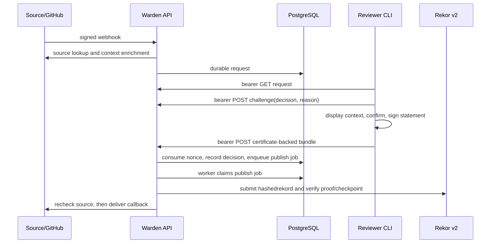

# Warden architecture

Warden is a small deployment approval service. A source adapter turns a
source webhook into a durable, source-neutral request; a reviewer sees that
request through the browser BFF and signs a decision with the CLI; a worker
publishes the decision to Rekor before delivering it back to the source.

## Request and decision paths

The browser BFF is a cookie session boundary. `/bff/login` and
`/bff/callback` perform the Keycloak/OIDC code flow, and `/bff/session`
returns the current user and CSRF token. Browser reads such as
`/bff/requests`, `/bff/requests/{id}`, `/bff/requests/{id}/evidence`, and
`/bff/decisions` use the HttpOnly same-origin session cookie. The BFF does not
give the browser an OIDC access token. Browser writes, including
`/bff/logout`, require the session CSRF token and origin checks.

Logout has two coordinated parts. The BFF deletes its server-side session and
expires the session cookie first. It then constructs an RP-initiated logout
URL from the `end_session_endpoint` in the issuer's discovery document, using
the configured BFF client ID and fixed post-logout URL. The React client
navigates to that URL so Keycloak can clear its SSO cookie before redirecting
back to Warden. Warden does not retain an ID token merely to use as an
`id_token_hint`; Keycloak accepts the client-ID form of the request. If
discovery does not provide an end-session endpoint, local logout remains
successful and the client returns to the sign-in screen. The redirect is an
operator-configured value and must also be allowlisted by the IdP client.

The CLI uses a separate bearer boundary. `warden decide` and `warden evidence
download` use the OIDC public `warden-cli` client, authorization-code PKCE,
the fixed loopback callback `127.0.0.1:18765`, audience `warden-cli`, and the
`warden:decide` scope. The CLI API is under `/api/v1`: it reads
`GET /requests/{id}`, obtains a one-time challenge with
`POST /requests/{id}/challenges`, submits a certificate-backed decision with
`POST /requests/{id}/decisions`, and reads evidence with
`GET /requests/{id}/evidence`. Cookies are rejected on this boundary. An
explicit `--access-token` is available for headless tests and automation; it
does not bypass bearer-token validation or reviewer-group authorization.

The challenge statement is bound to the displayed request, request ID,
decision, reason, authenticated subject, nonce, and expiry. The CLI displays
the context, requests the exact decision/reason challenge, asks for explicit
confirmation, and signs the returned statement. The service consumes the
request-bound nonce transactionally and accepts only one winning decision.

## Source boundary

The `source.Adapter` interface is the service's source boundary. Its webhook
method validates and normalizes an event, `Recheck` confirms that the source
state is still eligible before delivery, and `Deliver` sends the final
decision. The GitHub implementation performs the current webhook signature,
repository/callback, SHA, and workflow checks. The normalized event stores
source context as opaque bytes. Warden persists those bytes and passes them
back to the adapter; it does not interpret provider-specific fields in the
approval path.

## Identity, signing, and transparency

Keycloak is the OIDC boundary for this MVP. Enterprise SAML or Active
Directory integration belongs behind an IdP broker, so Warden continues to
consume the same issuer, audience, groups, and stable subject claims. Warden
does not contain a separate SAML or AD protocol implementation.

Decision statements use versioned canonical JSON and are signed through the
standard Go `crypto.Signer` interface. Development uses local PEM ECDSA
P-256 keys and certificates from `cmd/devinit`; the certificate URI carries
the stable OIDC subject. The seam permits an ADCS-issued certificate and a
PKCS#11/HSM-backed signer later without changing the evidence wire format.

The worker submits the canonical statement digest, signature, and certificate
as a Rekor v2 `hashedRekordRequestV002`. It persists Rekor's exact
`canonicalized_body`, inclusion path, and signed checkpoint in the evidence
bundle. Offline verification uses the independently configured checkpoint
public key and trusted checkpoint origin, verifies the signed note and
RFC6962 inclusion proof, and checks that the logged digest, signature, and
certificate are the bundle's values. Historical validity against an RFC 3161
timestamp is deliberately deferred; Rekor integrated time is not treated as
that timestamp.

The worker stores the published bundle and marks the request published before
calling the source adapter's delivery callback. A delivery retry reuses that
durable publication marker and does not submit another Rekor entry.

## Durability and failure handling

PostgreSQL stores requests, decisions, challenges, sessions, and publish jobs.
Jobs are claimed under row locks with `SKIP LOCKED`; failed work is returned
to pending with bounded backoff. Before delivery, the worker rechecks the
source. A cancelled or no-longer-eligible source run is recorded as
cancelled, and a request that expires is recorded as expired. The current
worker loop is single-process; the database locking is the foundation for
adding workers later.

## Security invariants

- Source webhooks require the configured HMAC signature and source-specific
  validation before a request is stored.
- OIDC tokens are checked at the API boundary for issuer, signature, audience,
  expiry, and `warden:decide`; decision endpoints also require the reviewer
  group.
- Browser sessions are HttpOnly and same-origin. Mutating BFF requests require
  origin validation and the session CSRF token.
- A challenge is bound to request ID, reviewer subject, decision, reason, and
  expiry; its nonce is consumed once under a transaction lock.
- A decision must match the request context digest, request ID, service,
  subject, challenge, and canonical statement signature. The certificate chain
  must terminate at configured development trust and contain the exact OIDC
  subject URI.
- Rekor verification is fail-closed without the independently configured
  checkpoint key. The logged canonicalized body is checked against the
  decision before inclusion is accepted.
- Development user private keys remain local to the CLI. Warden mounts only
  the app key, CA trust, and Rekor checkpoint public key; only the Rekor
  container mounts the Rekor signer.

## Production backlog

The following items are intentionally outside this tracer bullet:

- replace development CA material with managed certificate issuance (for
  example ADCS or Fulcio) and move signing keys to PKCS#11/HSM custody;
- configure enterprise IdP-broker federation, production group mapping, key
  rotation, and operational access controls;
- distribute Rekor trust roots through the organization's trust mechanism,
  add checkpoint witnessing/consistency monitoring, and validate trusted
  RFC 3161 timestamps historically;
- make workers and source delivery highly available, with metrics, alerting,
  durable backups, retention policy, and recovery drills;
- add production adapter registration and routing for multiple source types,
  with per-source credentials and policy configuration;
- replace the in-memory local GitHub mock with production source credentials
  and deployment policy configuration, and harden or remove its unauthenticated
  development admin routes.
